# CS 4641 Machine Learning, Team 6, Final Report
Members: Austin Barton, Karpagam Karthikeyan, Keyang Lu, Isabelle Murray, Aditya Radhakrishan

***

## Introduction
Our project's goal is to perform two different slightly different classification tasks on two different music audio datasets, MusicNet and GTZAN. For GTZAN, we are performing a genre classification task. For MusicNet, the task is to identify the composer for a given input of audio data from the baroque and classifcal periods of music. Both of these datasets are taken from [Kaggle](https://www.kaggle.com) and work in classification has recently gotten up to ~92% [[4.]](#references). Previous works struggled getting any model above 80% [[1.]](#references), [[2.]](#references). One study introduced a gradient boosted ensemble decision tree method called LightGBM that outperformed fully connected neural networks [[2.]](#references). Results these days outperform them but not much recent work has been done in using tree classifiers in this problem and most implementations appear to focus on neural network implementations. Therefore, we aim to re-examine decision trees' abilities for this task and attempt to improve upon neural network results. Additionally, in our exploratory data analysis and data pre-processing we would like to consider non-linear, as well as linear, dimensionality reduction techniques. We would like to evaluate these different methods similar to Pal et al., [[3]](#references), by reducing dimensions to a specified number, running a clustering algorithm on the data, and then evaluating results posthoc. In their results, t-SNE consistently outperformed other dimension reduction techniques. Therefore, we plan to use t-SNE in order to better understand and visualize our data in addition to principle components analysis (PCA). Currently, our work focuses on data pre-processing, visualization, using PCA for our dimensionality reduction technique, and obtaining base line results on minimally processed data with simple Feedforward Neural Network architectures.

### Datasets
**MusicNet**: We took this data from [Kaggle](kaggle.com). [MusicNet](https://www.kaggle.com/datasets/imsparsh/musicnet-dataset) is an audio dataset consisting of 330 WAV and MIDI files corresponding to 10 mutually exclusive classes. Each of the 330 WAV and MIDI files (per file type) corresponding to 330 separate classical compositions belong to 10 different composers from the classical and baroque periods. The total size of the dataset is approximately 33 GB and has 992 files in total. 330 of those are WAV, 330 are MIDI, 1 NPZ file of MusicNet features stored in a NumPy array, and a CSV of metadata. For this portion of the project, we essentially ignore the NPZ file and explore our own processing and exploration of the WAV and MIDI data for a more thorough understanding of the data and the task.

**GTZAN**: [GTZAN](https://www.kaggle.com/datasets/andradaolteanu/gtzan-dataset-music-genre-classification) is a genre recognition dataset of 30 second audio wav files at 41000 HZ sample rate, labeled by their genre. The sample rate of an audio file represent the number of sample, or real numbers, that the file represent one second of audio clip by. This means, for a 30 second wav file, the dimensionality of the dataset is 41000x30. The data set consists of 1000 wav files and 10 genres, with each genre consisting of 100 wav files. The genres include disco, metal, reggae, blues, rock, classical, jazz, hiphop, country, and pop. We took this data from [Kaggle](kaggle.com).

## Problem Definition
The problem that we want to solve is the classification of music data into specific categories (composers for MusicNet and genres for GTZAN). Essentially, the existing challenge is to improve previous accuracy benchmarks, especially with methods beyond neural networks, and to explore alternative models like decision trees. Our motivation for this project was to increase classification accuracy, improve the potential of decision trees in this domain, and to better understand and interpret the models that we chose to use. Our project aims to contribute to the field of music classification and expand the range of effective methodologies for similar tasks.

Despite the dominance of neural networks in recent works, there's motivation to enhance their performance and explore if combining methods can gain better results. The references and readings suggest that decision trees, especially gradient-boosted ones, might perform comparably and offer advantages in terms of training time and interpretability. Based on this, the project aims to effectively reduce the dimensionality of the datasets, enhancing the understanding and visualization of the data using techniques like t-SNE and PCA. 

## Methods Overview
- We utilize Principal Component Analysis on both datasets as our dimensionality reduction technique for visualization as well as pre-processing data.
- We implement t-distributed Stochastic Neighbor Embedding (t-SNE).
- We implement classiciation on the MusicNet dataset using decision trees, random forests, and gradient boosted trees.
- We implement classification on the GTZAN dataset using Feedforward Neural Networks/MLPs on WAV data and Convolution Neural Networks on Mel-Spectrogram PNG images. 
- Further discussion of these methods is explained in the Data Preprocessing and Classification sections.

### Exploratory Data Analysis (EDA)
**MusicNet**:
For MusicNet, we thoroughly explore visualization of both WAV and MIDI data files in various ways, using our own created methods, open-source programs, and a mix of the two. 

#### MIDI File Visualization
We will first go through the MIDI file exploration for Beethoven's 3rd Movement of the famous Moonlight Sonata composition. Something very important to be aware of is how many different MIDI file formats exist and how different some MIDI files may be in certain portions of their structure. The software we used to visualize and parse through MIDI files are open-source and can be found at [python-midi](https://github.com/vishnubob/python-midi/) and [music21](https://web.mit.edu/music21/). In the following example, the MIDI file is broken down into a left hand and right hand portion of the piano solo played. Below is a sample of the right hand and left hand from measures 1 to 10 shown in separate plots, in their respective order.

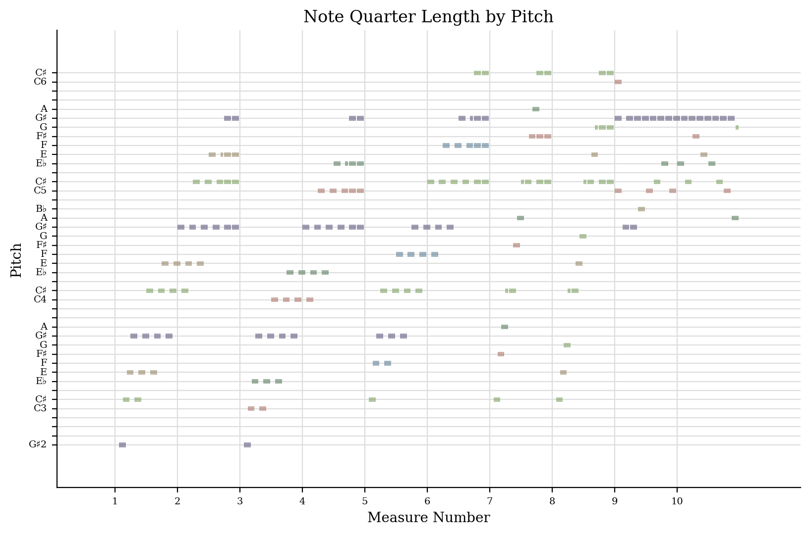
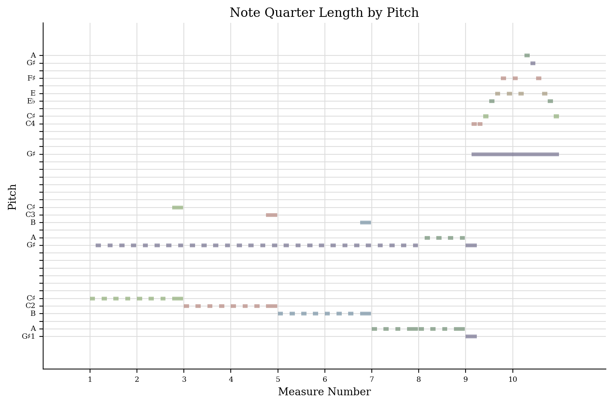

If you've ever listened to this song, you'll immediately recognize the overall pattern of the notes. Below is a sample of the left and right-hand notes from measures 1 to 6.

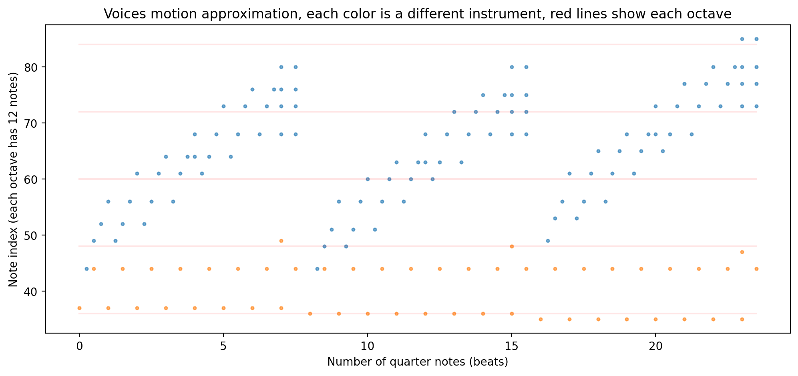

Below we show the frequencies of certain pitches and quarter-length notes at certain pitches.

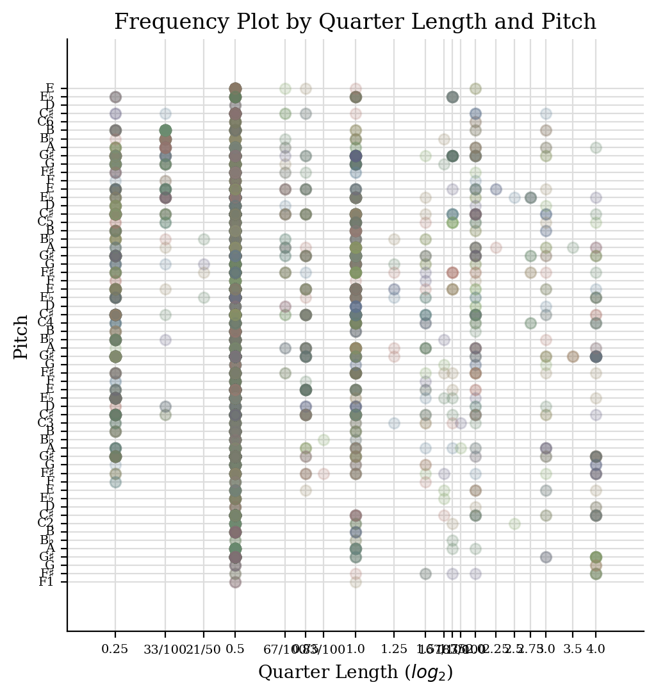
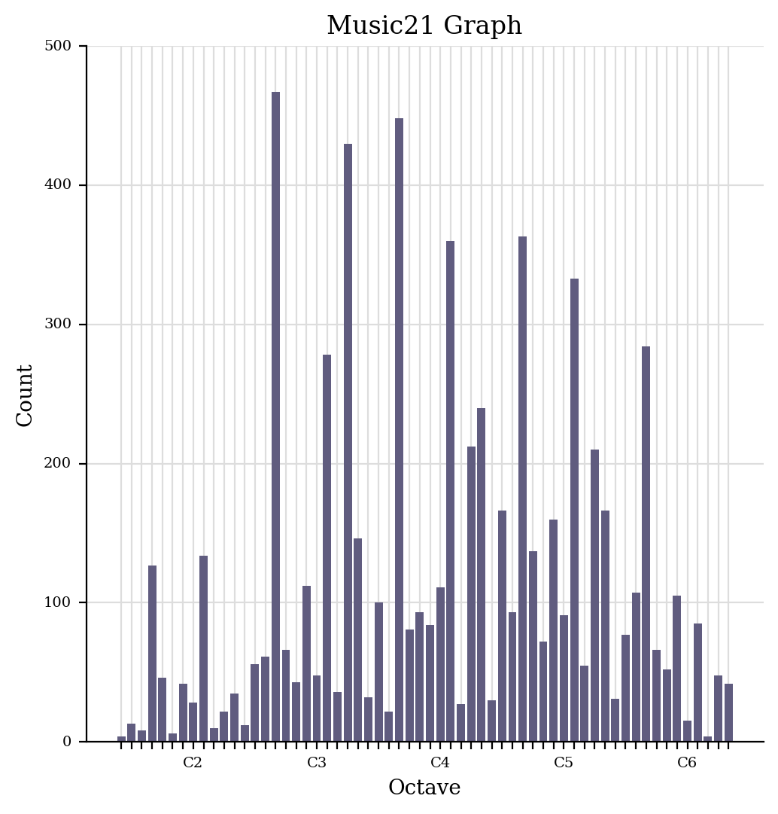

Below is an example of the pitch frequency in the vertical axis and the two coordinates along the horizontal directions are pitch and note length.

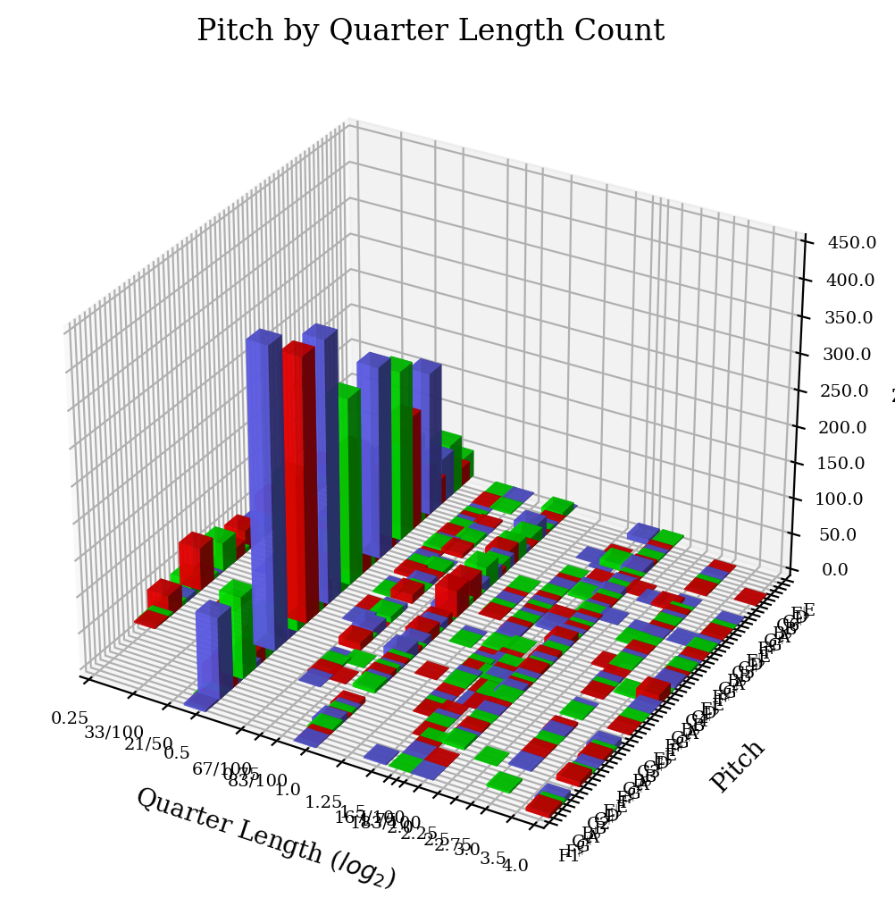

#### WAV File Visualization
Now we examine samples of WAV files for each composer in a multitude of ways. We obtain a random composition as a WAV file for each composer and visualize the data.

Visualizing the audio in time domain: Time on x-axis and Amplitude on y-axis. Here, in the following examples, the sampling rate is 22050 samples, i.e, in 1 second 22050 samples are taken. This means that the data is sampled every 0.046 milliseconds.

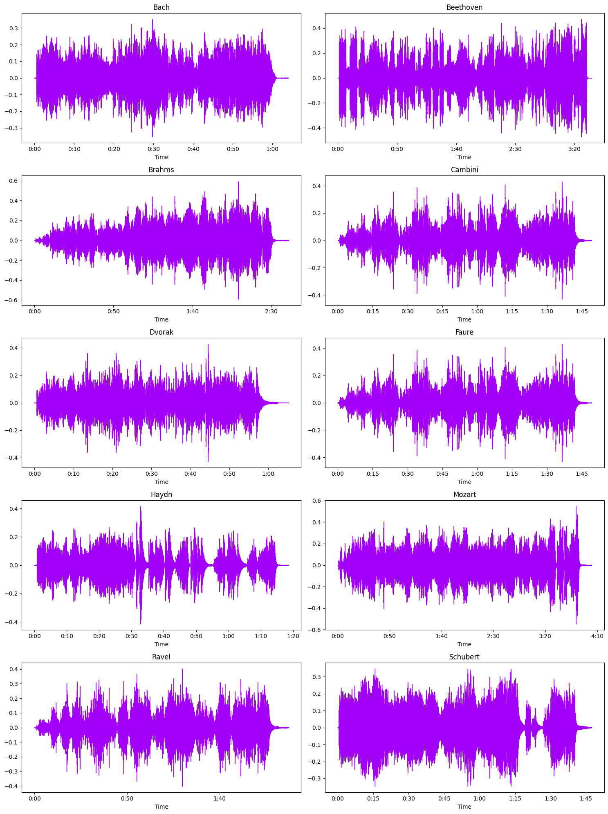

The zero crossing rate indicates the number of times that a signal crosses the horizontal axis.

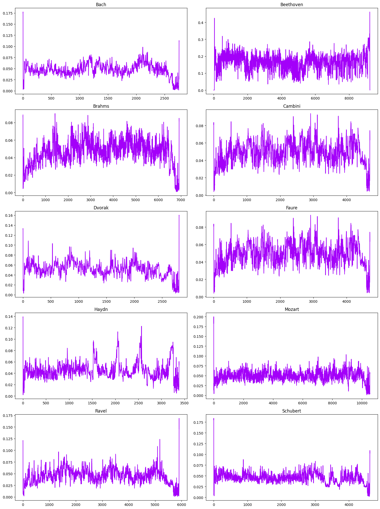

The STFT represents a signal in the time-frequency domain by computing discrete Fourier transforms (DFT) over short overlapping windows. Frequency is on the x-axis and Intensity is on the y-axis

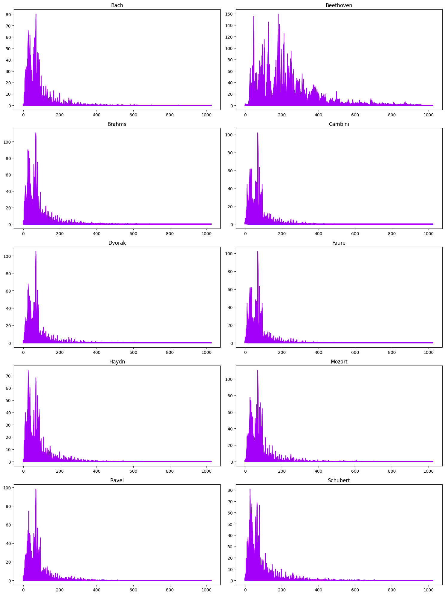

A Spectogram represents the intensity of a signal over time at various frequencies. Time is on the x-axis and Intensity of Frequency is on the y-axis

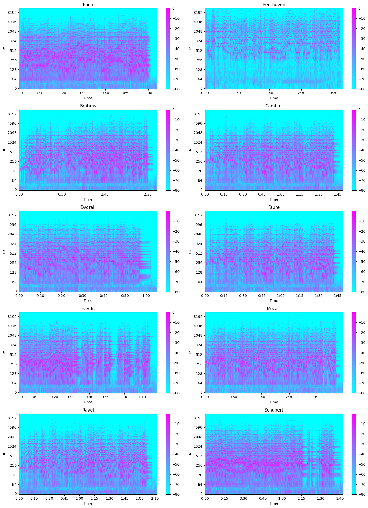

The Mel Scale is a logarithmic transformation of a signal’s frequency. The core idea of this transformation is that sounds of equal distance on the Mel Scale are perceived to be of equal distance to humans. Hence, it mimics our own perception of sound. The transformation of frequency to mel scale is:    *m = 1127xln(1 + f/700)* 
Mel Spectrograms are spectrograms that visualize sounds on the Mel scale.

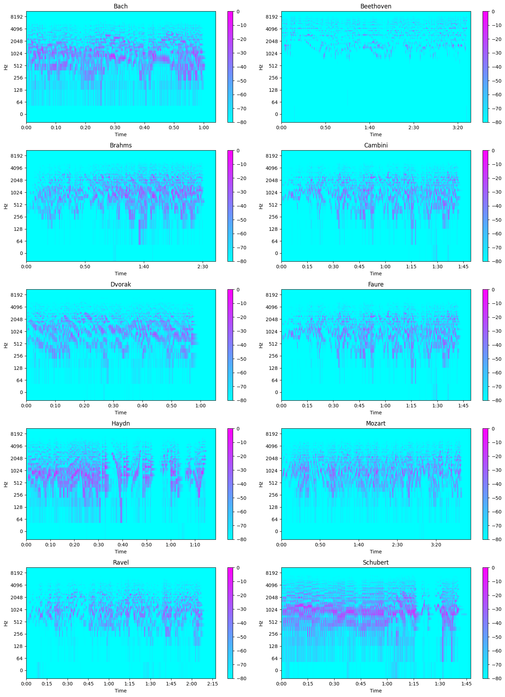

Chromagram sequence of chroma features each expressing how the representation's pitch content within the time window is spread over the twelve chroma bands/pitches.

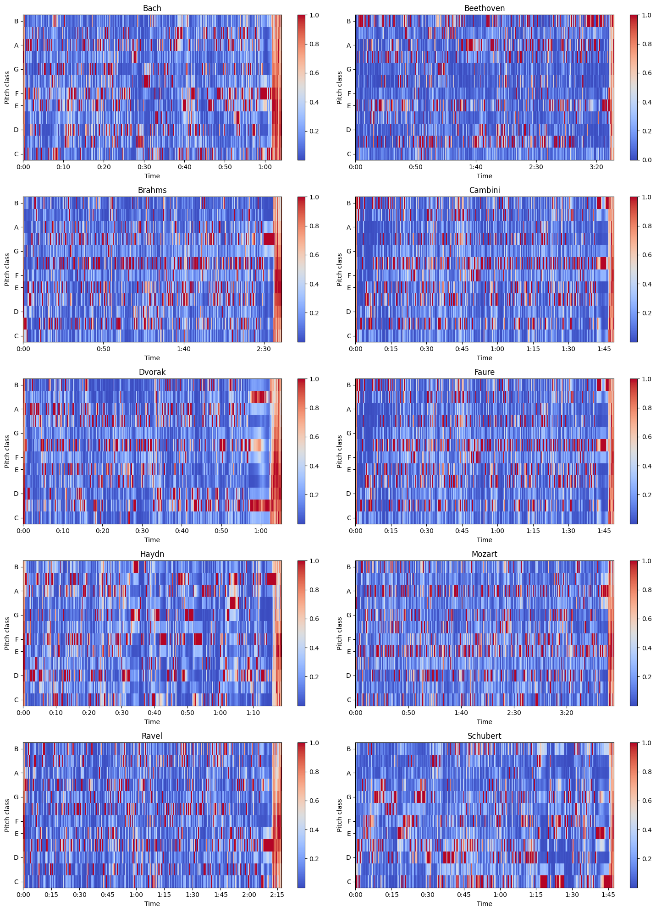

### Data Preprocessing
**MusicNet**:
#### MIDI Files
For the MIDI files, we aimed to create an algorithm to parse through MIDI files and convert into row vectors to be stored into a data matrix **X**. We utilize the MIDI parsing software from [python-midi](https://github.com/vishnubob/python-midi) to parse through the MIDI files and obtain tensors of float values that corresond to the instrument, the pitch of the note, and the loudness of the note. Each MIDI file generated a (**I**x **P**x **A**) tensor stored as a 3-D numpy array where **I** is the number of instruments, **P** is the total number of pitches, which range from (1-128), and the total number of quarter notes in the piece **A**. **I** is held as a constant of 16. For any instrument not played, it simply stores a matrix of zeroes. Additionally, the number of quarter notes in each piece is vastly different. Therefore, we require a way to process this data in a way that is homogenous in its dimensions.

We take the average values of each piece across the 3rd dimension (axis = 2) generating a 2-D array of size 16x128 where each entry is the average float value for that corresponding pitch and instrument across every note in the piece. From here, we flatten the 2-D array to generate a 1-D array of size 16*128 = 2048, where each block of values 128 entries long corresponds to an instrument. This flattening procedure respects the order of the instruments in a consistent manner across all MIDI files and is capable of storing instrument information for all MIDI files within the domain of the 16 instruments. The 16 instruments consist of the most common instruments in classical music including piano, violin, bass, cello, drums, voice, etc. Although the memory is costly, and the non-zero entries in each row vector are quite sparse, we determined that this procedure would be a viable method to maintain information in a manner that is feasible and reasonably efficient for our task.

In summary, we parse through each MIDI file and undergo a basic algorithm to generate row vectors of float values for each composition. We do this for each MIDI file and generate a data matrix X_{MIDI} that is a R^{330x2048} stored as a 2-D array of float values. This data matrix X_{MIDI} is what we will process through supervised models in the future and is the data we further explore with Principal Component Analysis detailed in the next section for MusicNet.

#### WAV Files
For WAV files, we obtain a 1-D array for each song consisting of amplitude float values. Each entry corresponds to a timestep in which the WAV file is sampled which is determined by the sampling rate specified when loading the data. We use the [librosa](https://librosa.org/doc/latest/index.html) audio analysis package in Python to load WAV files. After data is loaded, take intervals of the WAV data to act as a single data point. The sampling rate is defined as the average number of samples obtained in 1 second. It is used while converting the continuous data to a discrete data. For example, a 30 s song with a sampling rate of 2 would generate a 1-D float array of length 60. If we specify intervals of 3 s, then we would obtain 20 distinct data points each with 3 values (each for amplitude). A possible exploration with this data, because it is sequential, is to use models specifically tailored towards processing sequential data and learning relations between points in a sequence, such as transformers. However, we currently only perform this minimal processing for MusicNet in order to visualize and understand the data, and obtain baseline performances in supervised models to compare to performances with other processed data.

#### Images
Lastly, we discussed and showed a thorough treatment of visualization in the EDA section above. As done in [[2.]](#references), we plan on exploring using images as input data to perform the classficiation task, possibly in addition to other data, creating a multi-modal classification model. A likely supervised model we will explore for inputting images are Convolutional Neural Networks (CNNs).

**GTZAN**:
#### Extracted Features:
The GTZAN dataset also provides a list of extracted features. There are total of 58 features, which drastically reduces the dimensionality of our input data.

#### Frequency Space representation using Discrete FFT:
On top of doing supervised learning with the extracted features that the dataset provides, we also directly train on the wav files. To inrease the number of training examples and reduce the dimensionality of the data set, we use 2 second clips instead of the full 30 second clips. To translate the dataset to useful information, we must extract the frequency information. This is because musical notes are made of different frequencies. For example, the fundamental frequency of the middle C is 256 Hz. Translating audio segments into frequencies will allow the model to understand the input much better. To do this, we use a technique called the Fourier Transform. The fourier transform is a way to translate complex value functions into its frequency representations. In our application, we use the finite, discrete version of fourier transform that works on finite vectors rather than functions. In particular, we use a technique called Fast Fourier Transform (FFT) to speed up computation. For every m samples of the 2 second clip, we extract the frequency information from that vector in R^m. We create datasets using m values of 256 and 512. In the end, we end up with a training input of NxTxF, where the first dimension (N) indicates which training sample (2 second clip we are using), the second dimension (T) indicates which of the 256 sample time stamp in the 2 second clip we are in, and the third dimension (F) representing which frequencies (musical notes) are present during that clip. 

#### Dimensionality Reduction - PCA
**Principle Components Analysis**: Principle Components Analysis (PCA) is a linear dimensionality reduction technique that projects the features of the data along the directions of maximal (and orthogonal to one another) variance. These "new" features are called principle components and are project along what we call principal directions. The principal components can then be ordered by the amount of variance in each principal directions they were projected onto. If we have d dimensions, then we hope to be able to select d' < d new features that can still effectively separate the data in its corresponding reduced subspace. We choose PCA because of its high amount of interpretability, reasonable computational expensiveness, ubiquitousness, and effectiveness in reducing dimensions while maintaining crucial information and separability of data.

**MusicNet**: We perform dimensionality reduction using Principal Components Analysis (PCA) on the pre-processed MIDI data. We hope to be able reduce the number of features especially due to the large amount of sparsity in each row vector. Because most of the songs only have 1-2 instruments, which means that for most songs there would be at most 256 non-zero entries, we expect to be able to significanlty reduce the number of features while maintaining separability in our data. 

We can see that there is no separation between Beethoven and Bach classes in the first two principal directions.

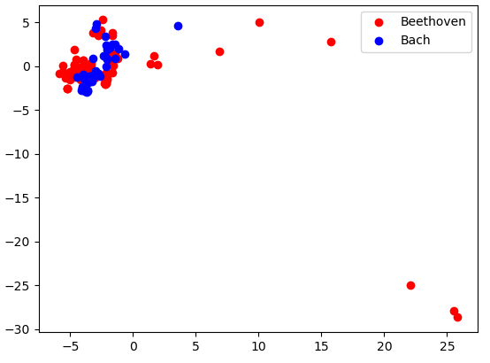

However, very clear separation between Cambini and Bach exists in our data in the first two principal directions.

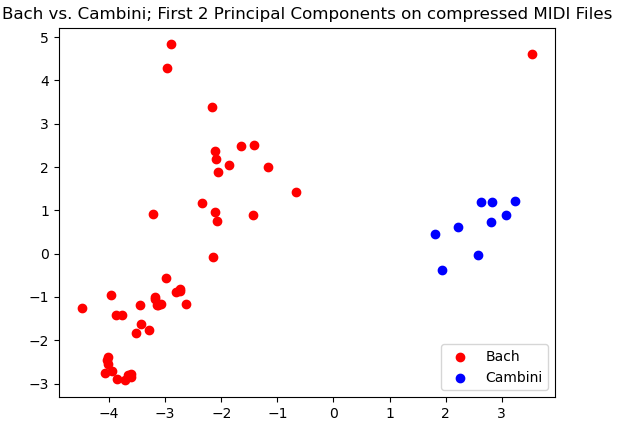

Here we see promising separation between Mozart and Cambini. Although they may not be linearly separable in this case, there is a clear distinction between the clusters of data in our data for their first two principal components.

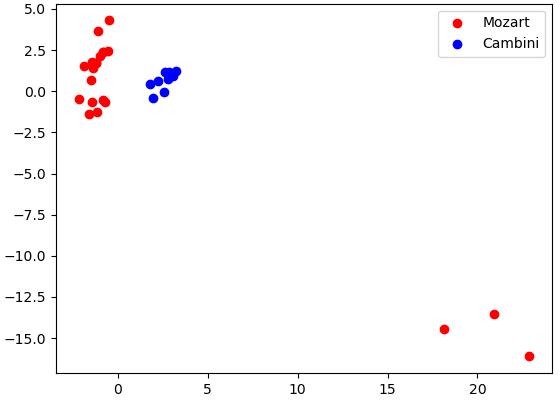

Here again we see a lack of separability for the first two principal components of Bach and Schubert. A strong contrast between Bach vs. Cambini, which did show a high amount of separability. This demonstrates that when performing this classification task on this processed MIDI data, it is likely that the model will struggle to perform well in delineating Bach and Schubert more than it does delineating Bach and Cambini.

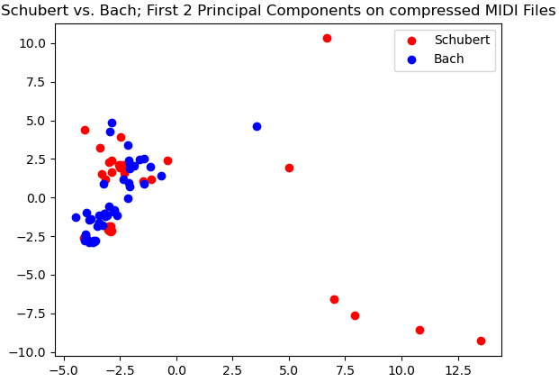

**GTZAN**:
After we get our dataset represented by a NxTxF matrix, we perform Principal Component Analysis (PCA) on the dataset. The reason we do this is to reduce the dimensionality of the dataset while mostly maintaining the information we have. This will allow us to train smaller and better models. To do this, we flatten the tensor into a (NT)xF matrix. We then perform PCA to get a (NT)xF' model. We then reshape it back to  a NxTxF' tensor. We will be testing models utilizing different values of F'.

#### Dimensionality Reduction - t-SNE
**t-distributed Stochastic Neighbor Embedding**: t-SNE, or t-Distributed Stochastic Neighbor Embedding, is a dimensionality reduction technique used for visualizing high-dimensional data in a lower-dimensional space, often two or three dimensions. It excels at preserving local relationships between data points, making it effective in revealing clusters and patterns that might be obscured in higher dimensions. The algorithm focuses on maintaining similarities between neighboring points, creating a visualization that accurately reflects the structure of the data. t-SNE is particularly valuable when exploring complex datasets with nonlinear relationships, as it can outperform traditional linear methods like PCA in capturing intricate structures. Its ability to uncover subtle patterns and groupings makes t-SNE a popular choice for exploratory data analysis and visualization tasks in various fields, including machine learning, biology, and natural language processing. Note that we only perform t-SNE on the MusicNet dataset.

**MusicNet MIDI Data t-SNE Results**

### Classification
#### **MusicNet** - Choice of Model and Algorithms:
**Chosen Model(s)**: We opted to only perform classification on the GTZAN dataset. MusicNet requires more thorough processing and either trimming the dataset down to obtain a better distribution of data by class or retrieving data manually. This is discussed more in the Discussion section.

## Results and Discussion
**Quantitative metrics**: Confusion Matrix

#### **GTZAN** - Choice of Model and Algorithms:
**Chosen Model(s)**: 

## Results and Discussion
**Quantitative metrics**: 3-second samples

F1 Scores, confusion matrix, etc.

- Confusion Matrix:

- Loss:

**Quantitative metrics**: 30-second samples

F1 Scores, confusion matrix, etc.

- Confusion Matrix:

- Loss: 

### Discussion
**MusicNet**:

**GTZAN**:

**Overall**:

## Next Steps
**MusicNet**:

**GTZAN**:

## Contribution Table

| Contributor Name      | Contribution Type                      |
|------------------------|----------------------------------------|
| Austin Barton          | MusicNet Data Pre-Processing, MusicNet PCA, MIDI Parsing, Data Visualization, GitHub Pages|
| Aditya Radhakrishnan   | Model Design & Implementation, Development/Iteration, Validation, Testing, Results Generation & Visualization, and Early Dataset Balancing Exploration                              |
| Isabelle Murray        | GanttChart, Model Implementation/development, Testing, Results Generation & Visualization  |
| Karpagam Karthikeyan   | GanttChart, MusicNet Data Pre-Processing, Github Pages, Data Visualization, MIDI Parsing         |
| Niki (Keyang) Lu       | Video presentation, GTZAN Data Preprocessing & Visualization                |

## Gantt Chart
Link to Gantt Chart: [Gantt Chart](https://gtvault-my.sharepoint.com/:x:/g/personal/kkarthikeyan8_gatech_edu/EVjVKvZA0_xLh_aF5jo_iTEBVskxE3vAHkcjEn6QkRMpAQ?e=xVssxk)

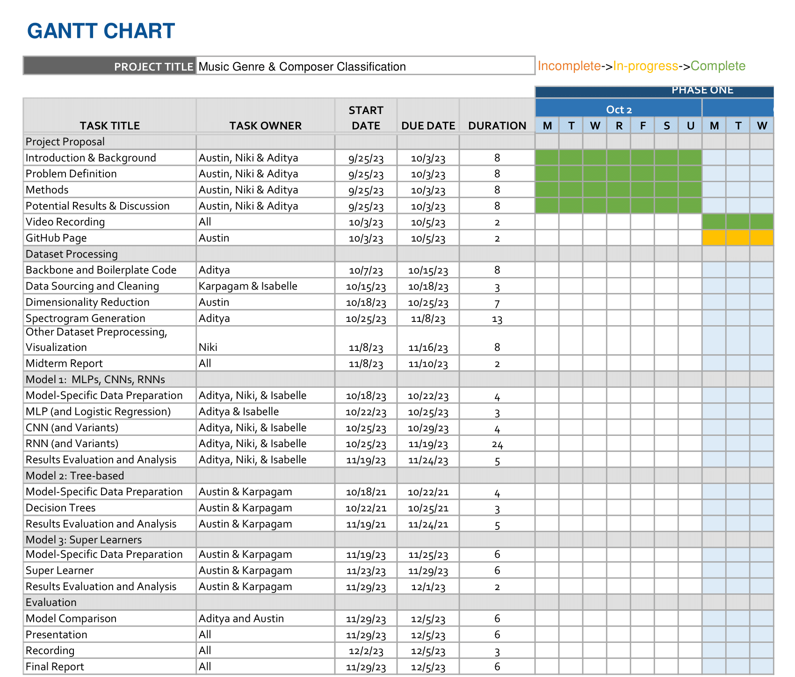

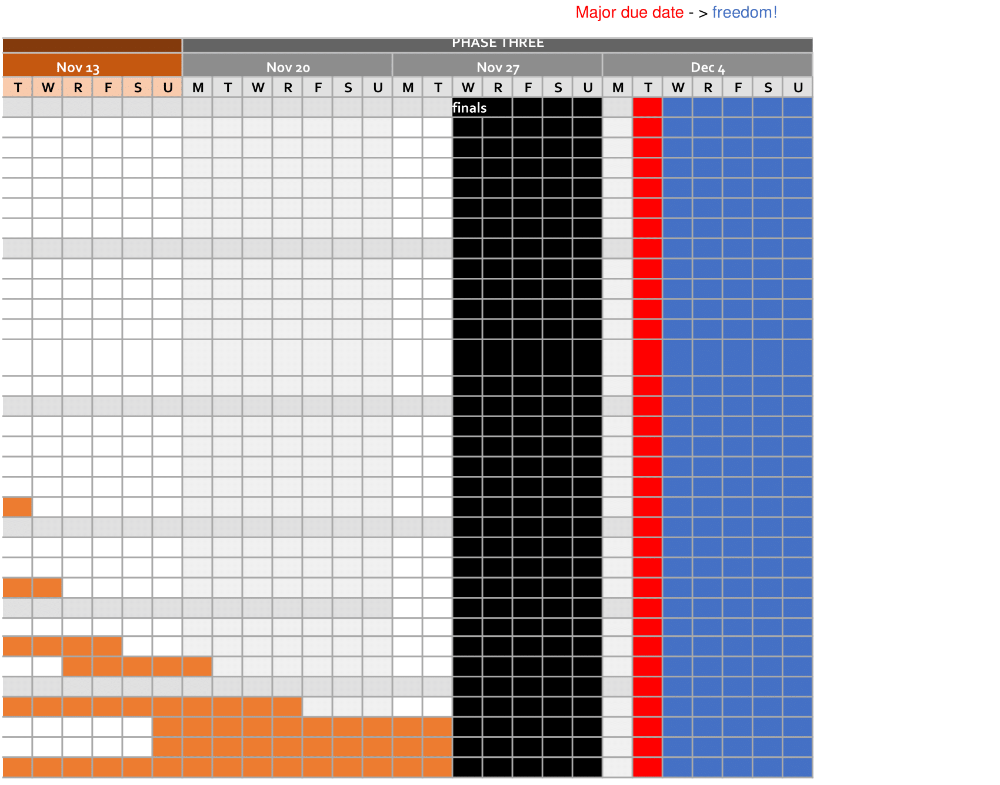

# References
[1.] Pun, A., &; Nazirkhanova, K. (2021). Music Genre Classification with Mel Spectrograms and CNN

[2.] Jain, S., Smit, A., &; Yngesjo, T. (2019). Analysis and Classification of Symbolic Western Classical Music by Composer.

[3.] Pál, T., & Várkonyi, D.T. (2020). Comparison of Dimensionality Reduction Techniques on Audio Signals. Conference on Theory and Practice of Information Technologies.

