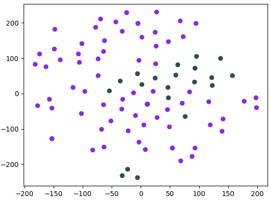
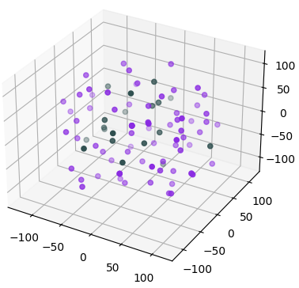
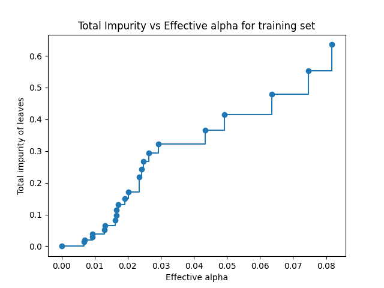
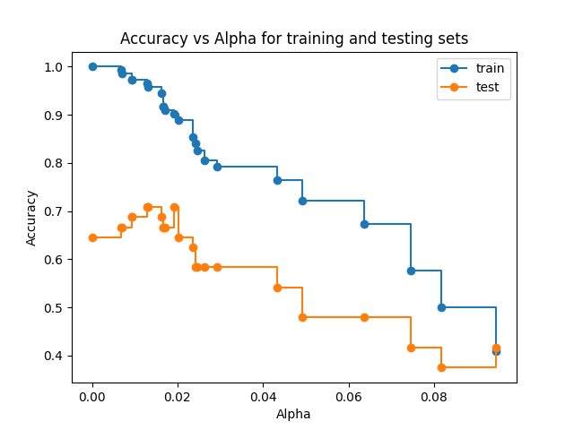
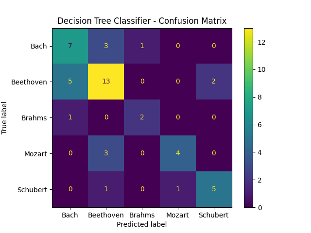
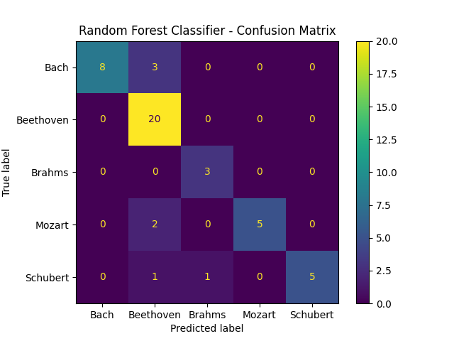
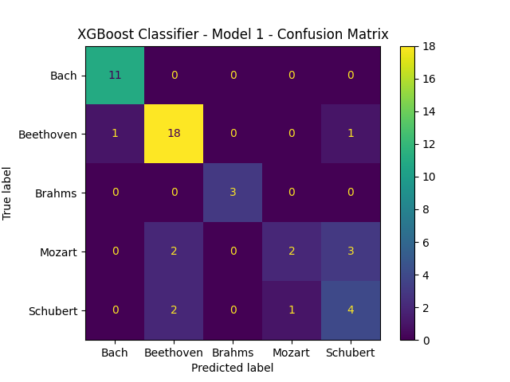
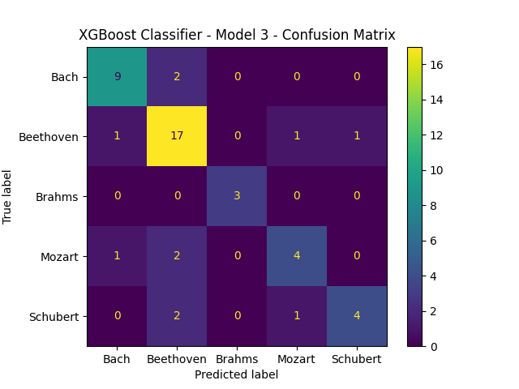

# CS 4641 Machine Learning, Team 6, Final Report
Members: Austin Barton, Karpagam Karthikeyan, Keyang Lu, Isabelle Murray, Aditya Radhakrishan

***

# Table of Contents

- [CS 4641 Machine Learning, Team 6, Final Report](#cs-4641-machine-learning-team-6-final-report)
- [Table of Contents](#table-of-contents)
  - [Introduction](#introduction)
    - [Datasets](#datasets)
    - [Overview of Methods and Data Processing](#overview-of-methods-and-data-processing)
  - [Problem Definition](#problem-definition)
  - [Data Preprocessing](#data-preprocessing)
      - [MIDI Files](#midi-files)
      - [WAV Files](#wav-files)
      - [Extracted Features:](#extracted-features)
      - [Frequency Space representation using Discrete FFT:](#frequency-space-representation-using-discrete-fft)
      - [Dimensionality Reduction - PCA](#dimensionality-reduction---pca)
      - [Dimensionality Reduction - t-SNE](#dimensionality-reduction---t-sne)
  - [Classification Methods](#classification-methods)
    - [**MusicNet** - Choice of Model and Algorithms:](#musicnet---choice-of-model-and-algorithms)
      - [**Decision Trees**](#decision-trees)
      - [**Random Forests**](#random-forests)
      - [**Gradient-Boosted Trees**](#gradient-boosted-trees)
    - [**GTZAN** - Choice of Model and Algorithms:](#gtzan---choice-of-model-and-algorithms)
  - [Results and Discussion](#results-and-discussion)
    - [MusicNet Results](#musicnet-results)
      - [Decision Trees](#decision-trees-1)
      - [Random Forests](#random-forests-1)
      - [Gradient-Boosted Trees](#gradient-boosted-trees-1)
    - [GTZAN Results](#gtzan-results)
    - [Discussion](#discussion)
  - [Next Steps](#next-steps)
  - [Contribution Table](#contribution-table)
  - [Gantt Chart](#gantt-chart)
- [References](#references)

## Introduction
This project addresses the challenges of music audio classification through two distinct tasks on Kaggle datasets, MusicNet and GTZAN. For GTZAN, the objective is genre classification, while for MusicNet, the focus is on identifying composers from the baroque and classical periods. Notably, recent advancements in classification have achieved approximately 92% accuracy [[4.]](#references), surpassing previous struggles to breach the 80% mark [[1.]](#references), [[2.]](#references). While neural networks dominate current implementations, our study revisits the efficacy of decision trees, particularly gradient-boosted trees, which have demonstrated superior performance in comparison on some cases.

In addition to model exploration, our project delves into data analysis and pre-processing techniques. Both linear and non-linear dimensionality reduction methods are considered, inspired by Pal et al's., [[3]](#references) approach. We adopt t-SNE and PCA for dimensionality reduction, leveraging their ability to unveil underlying patterns in the data. We assess and compare the results of these methods visually. In contrast to work by Pal et al., [[3]](#refrences), t-SNE performed worse visually than PCA.

The primary focus of our work lies in comprehensive data pre-processing and visualization. We employ PCA as the primary dimensionality reduction technique, aiming to establish baseline results using minimally processed data with straightforward Feedforward Neural Network architectures. This approach contributes to the understanding of audio (specifically, music audio) datasets and opens questions and important notes for future improvements in music audio classification tasks, emphasizing the potential of decision tree models (and their variants) and the significance of effective dimensionality reduction techniques. Our findings also open up for models specific to sequential data.

### Datasets
**MusicNet**: We took this data from [Kaggle](kaggle.com). [MusicNet](https://www.kaggle.com/datasets/imsparsh/musicnet-dataset) is an audio dataset consisting of 330 WAV and MIDI files corresponding to 10 mutually exclusive classes. Each of the 330 WAV and MIDI files (per file type) corresponding to 330 separate classical compositions belong to 10 different composers from the classical and baroque periods. The total size of the dataset is approximately 33 GB and has 992 files in total. 330 of those are WAV, 330 are MIDI, 1 NPZ file of MusicNet features stored in a NumPy array, and a CSV of metadata. For this portion of the project, we essentially ignore the NPZ file and explore our own processing and exploration of the WAV and MIDI data for a more thorough understanding of the data and the task. Further discussion of the data processing is described in detail in the [Data Preprocessing](#data-preprocessing) section.

Because of how poorly distributed this data is, and not being able to gather new data ourselves, we opted to only do composer classification on a subset of the original data. Any composer with less than 10 pieces in the dataset was completely excluded. This resulted in reducing the number of composers/classes from 10 to 5. The remaining composers are Bach, Beethoven, Brahms, Mozart, and Schubert. This subset is still heavily imbalanced, as Beethoven has over 100 samples of data but Brahms has 10.

**GTZAN**: [GTZAN](https://www.kaggle.com/datasets/andradaolteanu/gtzan-dataset-music-genre-classification) is a genre recognition dataset of 30 second audio wav files at 41000 HZ sample rate, labeled by their genre. The sample rate of an audio file represent the number of sample, or real numbers, that the file represent one second of audio clip by. This means, for a 30 second wav file, the dimensionality of the dataset is 41000x30. The data set consists of 1000 wav files and 10 genres, with each genre consisting of 100 wav files. The genres include disco, metal, reggae, blues, rock, classical, jazz, hiphop, country, and pop. We took this data from [Kaggle](kaggle.com).

### Overview of Methods and Data Processing
- We utilize Principal Component Analysis on both datasets as our dimensionality reduction technique for visualization as well as pre-processing data.
- We implement t-distributed Stochastic Neighbor Embedding (t-SNE) and compare with PCA.
- We implement classiciation on the MusicNet dataset using decision trees, random forests, and gradient-boosted trees.
- We implement classification on the GTZAN dataset using Feedforward Neural Networks/MLPs on WAV data and Convolution Neural Networks on Mel-Spectrogram PNG images. 
- Further discussion of these methods is explained in the Data Preprocessing and Classification sections.

## Problem Definition
The problem that we want to solve is the classification of music data into specific categories (composers for MusicNet and genres for GTZAN). Essentially, the existing challenge is to improve previous accuracy benchmarks, especially with methods beyond neural networks, and to explore alternative models like decision trees. Our motivation for this project was to increase classification accuracy, improve the potential of decision trees in this domain, and to better understand and interpret the models that we chose to use. Our project aims to contribute to the field of music classification and expand the range of effective methodologies for similar tasks.

Despite the dominance of neural networks in recent works, there's motivation to enhance their performance and explore if combining methods can gain better results. The references and readings suggest that decision trees, especially gradient-boosted ones, might perform comparably and offer advantages in terms of training time and interpretability. Based on this, the project aims to effectively reduce the dimensionality of the datasets, enhancing the understanding and visualization of the data using techniques like t-SNE and PCA. 

## Data Preprocessing
**MusicNet**:
#### MIDI Files
For the MIDI files, we aimed to create an algorithm to parse through MIDI files and convert into row vectors to be stored into a data matrix **X**. We utilize the MIDI parsing software from [python-midi](https://github.com/vishnubob/python-midi) to parse through the MIDI files and obtain tensors of float values that corresond to the instrument, the pitch of the note, and the loudness of the note. Each MIDI file generated a (**I**x **P**x **A**) tensor stored as a 3-D numpy array where **I** is the number of instruments, **P** is the total number of pitches, which range from (1-128), and the total number of quarter notes in the piece **A**. **I** is held as a constant of 16. For any instrument not played, it simply stores a matrix of zeroes. Additionally, the number of quarter notes in each piece is vastly different. Therefore, we require a way to process this data in a way that is homogenous in its dimensions.

We take the average values of each piece across the 3rd dimension (axis = 2) generating a 2-D array of size 16x128 where each entry is the average float value for that corresponding pitch and instrument across every note in the piece. From here, we flatten the 2-D array to generate a 1-D array of size 16*128 = 2048, where each block of values 128 entries long corresponds to an instrument. This flattening procedure respects the order of the instruments in a consistent manner across all MIDI files and is capable of storing instrument information for all MIDI files within the domain of the 16 instruments. The 16 instruments consist of the most common instruments in classical music including piano, violin, bass, cello, drums, voice, etc. Although the memory is costly, and the non-zero entries in each row vector are quite sparse, we determined that this procedure would be a viable method to maintain information in a manner that is feasible and reasonably efficient for our task.

In summary, we parse through each MIDI file and undergo a basic algorithm to generate row vectors of float values for each composition. We do this for each MIDI file and generate a data matrix X_{MIDI} that is a R^{330x2048} stored as a 2-D array of float values. This data matrix X_{MIDI} is what we will process through supervised models in the future and is the data we further explore with Principal Component Analysis detailed in the next section for MusicNet.

#### WAV Files
For WAV files, we obtain a 1-D array for each song consisting of amplitude float values. Each entry corresponds to a timestep in which the WAV file is sampled which is determined by the sampling rate specified when loading the data. We use the [librosa](https://librosa.org/doc/latest/index.html) audio analysis package in Python to load WAV files. After data is loaded, take intervals of the WAV data to act as a single data point. The sampling rate is defined as the average number of samples obtained in 1 second. It is used while converting the continuous data to a discrete data. For example, a 30 s song with a sampling rate of 2 would generate a 1-D float array of length 60. If we specify intervals of 3 s, then we would obtain 20 distinct data points each with 3 values (each for amplitude). A possible exploration with this data, because it is sequential, is to use models specifically tailored towards processing sequential data and learning relations between points in a sequence, such as transformers. However, we currently only perform this minimal processing for MusicNet in order to visualize and understand the data, and obtain baseline performances in supervised models to compare to performances with other processed data.

**GTZAN**:
#### Extracted Features:
The GTZAN dataset also provides a list of extracted features. There are total of 58 features, which drastically reduces the dimensionality of our input data.

#### Frequency Space representation using Discrete FFT:
On top of doing supervised learning with the extracted features that the dataset provides, we also directly train on the wav files. To inrease the number of training examples and reduce the dimensionality of the data set, we use 2 second clips instead of the full 30 second clips. To translate the dataset to useful information, we must extract the frequency information. This is because musical notes are made of different frequencies. For example, the fundamental frequency of the middle C is 256 Hz. Translating audio segments into frequencies will allow the model to understand the input much better. To do this, we use a technique called the Fourier Transform. The fourier transform is a way to translate complex value functions into its frequency representations. In our application, we use the finite, discrete version of fourier transform that works on finite vectors rather than functions. In particular, we use a technique called Fast Fourier Transform (FFT) to speed up computation. For every m samples of the 2 second clip, we extract the frequency information from that vector in R^m. We create datasets using m values of 256 and 512. In the end, we end up with a training input of NxTxF, where the first dimension (N) indicates which training sample (2 second clip we are using), the second dimension (T) indicates which of the 256 sample time stamp in the 2 second clip we are in, and the third dimension (F) representing which frequencies (musical notes) are present during that clip.

#### Dimensionality Reduction - PCA
**Principle Components Analysis**: Principle Components Analysis (PCA) is a linear dimensionality reduction technique that projects the features of the data along the directions of maximal (and orthogonal to one another) variance. These "new" features are called principle components and are project along what we call principal directions. The principal components can then be ordered by the amount of variance in each principal directions they were projected onto. If we have d dimensions, then we hope to be able to select d' < d new features that can still effectively separate the data in its corresponding reduced subspace. We choose PCA because of its high amount of interpretability, reasonable computational expensiveness, ubiquitousness, and effectiveness in reducing dimensions while maintaining crucial information and separability of data.

**MusicNet**: We perform dimensionality reduction using Principal Components Analysis (PCA) on the pre-processed MIDI data. We hope to be able reduce the number of features especially due to the large amount of sparsity in each row vector. Because most of the songs only have 1-2 instruments, which means that for most songs there would be at most 256 non-zero entries, we expect to be able to significanlty reduce the number of features while maintaining separability in our data. 

We can see that there is no separation between Beethoven and Bach classes in the first two principal directions.

However, very clear separation between Cambini and Bach exists in our data in the first two principal directions.

Here we see promising separation between Mozart and Cambini. Although they may not be linearly separable in this case, there is a clear distinction between the clusters of data in our data for their first two principal components.

Here again we see a lack of separability for the first two principal components of Bach and Schubert. A strong contrast between Bach vs. Cambini, which did show a high amount of separability. This demonstrates that when performing this classification task on this processed MIDI data, it is likely that the model will struggle to perform well in delineating Bach and Schubert more than it does delineating Bach and Cambini.

**GTZAN**:
After we get our dataset represented by a NxTxF matrix, we perform Principal Component Analysis (PCA) on the dataset. The reason we do this is to reduce the dimensionality of the dataset while mostly maintaining the information we have. This will allow us to train smaller and better models. To do this, we flatten the tensor into a (NT)xF matrix. We then perform PCA to get a (NT)xF' model. We then reshape it back to  a NxTxF' tensor. We will be testing models utilizing different values of F'.

#### Dimensionality Reduction - t-SNE
**t-distributed Stochastic Neighbor Embedding**: t-SNE, or t-Distributed Stochastic Neighbor Embedding, is a dimensionality reduction technique used for visualizing high-dimensional data in a lower-dimensional space, often two or three dimensions. It excels at preserving local relationships between data points, making it effective in revealing clusters and patterns that might be obscured in higher dimensions. The algorithm focuses on maintaining similarities between neighboring points, creating a visualization that accurately reflects the structure of the data. t-SNE is particularly valuable when exploring complex datasets with nonlinear relationships, as it can outperform traditional linear methods like PCA in capturing intricate structures. Note that we only perform t-SNE on the MusicNet dataset.

Our t-SNE results were strikingly poor in comparison to the PCA results shown above. We demonstrate only one plot for the sake of this report's brevity, but most class pairs were not linearly separable in 2 or 3 dimensions.

In purple are data points belonging to Beethoven and in green are data points belonging to Mozart.

Here are the data points but in a 3-dimensional space reduced by t-SNE from the original 2048 dimensions.

## Classification Methods
### **MusicNet** - Choice of Model and Algorithms:
**Chosen Model(s)**: We decided to use decision trees, random forests, and gradient-boosted trees for our models.

#### **Decision Trees**
Methods in this section were inspired from a previous course taken, MATH 4210, and [sci-kit learn's documentation](https://scikit-learn.org/stable/auto_examples/tree/plot_cost_complexity_pruning.html).

Before jumping to more complicated, expensive, and generally less interpretable models, we analyze the results of classification with a single decision tree. Undergoing a proper analysisa dn hyperparametrization of a single decision tree will provide us insight even if the model does not perform well. This will set us up for success and narrow hyperparameter search spaces in the subsequent models.

Decision tree classifiers are models that recursively split data based on features, forming a tree-like structure. Each node represents a decision based on a feature, leading to subsequent nodes. Terminal nodes provide predictions.

| Hyperparameter        | Description                                          | Value(s)               |
|-----------------------|------------------------------------------------------|------------------------|
| `criterion   `        | The function to measure the quality of a split       | `gini`                 |
| `max_depth`           | Maximum depth of the individual trees                | 10                     |
| `random_state`        | Seed for random number generation                    | seed=42                |

We performed a search over the best value of the cost complexity pruning penalty. This is a penalty coefficient of the complexity of the decision tree, where complexity is measured by the number of leaves in a tree (very similar to ridge and LASSO regression). Below we can see how as we increase the cost complexity hyperparameter (alpha), the total gini impurity of the leaves increases.

However, this does not mean the model is performing worse as the cost complexity penalty increases. As shown below, there is an optimal cost complexity penality found at around ~0.02 that results in the best test accuracy of the model. This is the cost complexity penalty we use for our decision tree.

#### **Random Forests**
Random Forest classifiers are an ensemble learning method combining multiple decision tree classifiers. Each tree is trained on a random subset of data and features. The final prediction is an average or voting of individual tree predictions.

| Hyperparameter        | Description                                          | Value(s)               |
|-----------------------|------------------------------------------------------|------------------------|
| `n_estimators`        | Number of boosting stages to be run                  | 100                    |
| `max_depth`           | Maximum depth of the individual trees                | 13                     |
| `max_features`        | Number of features to consider for the best split    | 1024                   |
| `random_state`        | Seed for random number generation                    | seed=42                |

Since random forests in our case are very computationally feasible, and since our analysis of decision tree performance based on depth provides insight, we opted to search through what `max_depth` hyperparameter would perform the best. We experimentally found `max_depth` of 13 to work the best for random forests, in contrast to the best depth for a single decision tree to be 10. Our choice of `max_features` was based off the fact that many of the data samples are sparse in non-zero entries and only few contain more than 1024 entries (and not by much more) we felt 0.5 to be reasonable and through experimentation found it to be effective.

#### **Gradient-Boosted Trees**
Gradient-boosted trees are a type of ensemble learning technique that builds a series of decision trees sequentially, defines an objective/cost function to minimize (very similar to neural network cost functions), and uses the gradient of the cost function to iteratively guide the next sequential tree to improve the overall model. Each tree corrects errors of the previous one and the ensemble model is trained over a defined number of iterations, similar to neural networks. Hence, this model requires lots of hyperparametrization and is in general much more computationally costly compared to decision trees and random forests. Additionally, they are more difficult to interpret.

**Model 1 Hyperparameters**:

| Hyperparameter        | Description                                          | Value(s)               |
|-----------------------|------------------------------------------------------|------------------------|
| `n_estimators`        | Number of boosting stages to be run                  | 20                     |
| `learning_rate`       | Step size shrinkage to prevent overfitting           | 0.8                    |
| `max_depth`           | Maximum depth of the individual trees                | 10                     |
| `subsample`           | Proportion of features to consider for the best split| 0.5                    |
| `objective`           | The objective function this model is minimizing      | `multi:softmax`        |
| `early_stopping`      | Stop training early if evaluation doesn't improve    | None                   |
| `random_state`        | Seed for random number generation                    | seed=42                |

**Model 2 Hyperparameters**:

| Hyperparameter        | Description                                          | Value(s)               |
|-----------------------|------------------------------------------------------|------------------------|
| `n_estimators`        | Number of boosting stages to be run                  | 1000                   |
| `learning_rate`       | Step size shrinkage to prevent overfitting           | 0.8                    |
| `max_depth`           | Maximum depth of the individual trees                | 10                     |
| `subsample`           | Proportion of features to consider for the best split| 0.5                    |
| `objective`           | The objective function this model is minimizing      | `multi:softmax`        |
| `early_stopping`      | Stop training early if evaluation doesn't improve    | 100                    |
| `random_state`        | Seed for random number generation                    | seed=42                |
| `eval_metric`         | Evaluation metrics                                   | `auc` and `merror`     |

We chose these hyperparameters based off of 1) The results from decision trees and random forests and 2) Our own experimentation searching through the space of possible hyperparameters. These 2 models are essentially the same, but we want to showcase how gradient-boosted trees, although effective, come to limits that adding more iterations will not fix. Our learning rate was tuned through experimentation and searching. The `max_depth` was experimented with and the results from random forests and decision trees helped guide this selection. We found that including all the features in our model reduced performance and results in the models overfitting extremely fast. Because many of the row vectors are sparse and only few containing more than 1000 entries, we felt 0.5 to be reasonable and through experimentation found it to be effective. We chose the AUC evaluation metric since it does a better job at evaluating classification performance in imbalanced datasets. Lastly, we implement an early stopping of 100 to not waste time and computational resources. The model will stop training and return the best performing model if after 100 iterations the evaluation metrics do not improve.

### **GTZAN** - Choice of Model and Algorithms:
**Chosen Model(s)**: 

## Results and Discussion

### MusicNet Results

#### Decision Trees

We fit our decision tree with the cost complexity hyperparameter described [previously](#classification). The depth of our resulting tree is 10 (hence, the justification behind this `max_depth` hyperparameter), providing insight for subsequent models as to how deep a tree should or should not be. The results of this tree are summarized below in a confusion matrix, training and testing accuracy, and F1-score.

**A note on F1-Score and AUC:** For this section, we use a weighted average F1-score and weighted average Area Under the receiver operating Curve (AUC). The reason we weight these scores is due to the imbalance in the classes for this dataset. The F1-score metric is the harmonic mean of precision and reall. Thus, it acts as an aggregated metric for both precision and recall. Because it's defined on a binary case of true/false postive/negatives, each class has its corresponding F1-score. These values are then aggregated by a weighted average into one value, as reported below. The AUC metric is an aggregate measurement of true and false positive rates derived from the ROC plot, which plots the true positive rate (TPR) against the false positive rate (FPR) at each threshold setting. Similarly to the F1-score, this is a binary classification statistics. Therefore, each class has their own AUC score which is aggregated into a single reported AUC. We use both the 1 vs Rest and 1 vs 1 methods. 1 vs Rest divides the data into two classes as the 1 class we are measuring (positive), and the rest (negatives). The 1 vs 1 method only looks at pairwise comparisons between each class as the positives and negatives. Both of the metrics for measuring classification performance are highly regarded and tend to perform better than accuracy alone, especially in imbalanced datasets such as this one [[5.]](#references), [[6.]].

Decision Tree Classifier Results:
- Training Accuracy: 1.0
- Test Accuracy: 0.6458333333333334
- Test F1-Score: 0.6475694444444445
- Test 1v1 AUC-Score: 0.7684729549963925
- Test 1vRest AUC-Score: 0.7462224419541492

We can see the model does actually quite well for how little training data there is and how poorly the data is distributed. This landmark shows that our processing algorithm for the MIDI is effective to at least some extent in distinguishing certain composers from others.

#### Random Forests

Results of random forest classifier described in the [classification](#classification) section.

Random Forest Classifier Results:
- Training Accuracy: 1.0
- Test Accuracy: 0.8541666666666666
- Test F1-Score: 0.8519282808470453
- Test 1v1 AUC-Score: 0.9701817279942282
- Test 1vRest AUC-Score: 0.9668985078283857

We can see that random forests drastically improve classification results. Since random forests are highly interpretable and cost efficient, we would opt for this model over other less interpretable and cost ineffecitve models. This idea is showcased in the subsequent section with the introduction of gradient-boosted trees.

#### Gradient-Boosted Trees

- **Boosted-Decision Trees Training Results**
Model 1 Training Table:

| Iteration | Train AUC | Train Misclassification Error | Eval AUC | Eval Misclassification Error |
|-----------|-----------|-------------------------------|----------|-------------------------------|
| 0         | 0.86054   | 0.36111                       | 0.77116  | 0.52083                       |
| 1         | 0.93284   | 0.21528                       | 0.82366  | 0.47917                       |
| 2         | 0.95528   | 0.19444                       | 0.84713  | 0.29167                       |
| 3         | 0.96822   | 0.17361                       | 0.88281  | 0.25000                       |
| 4         | 0.97271   | 0.15972                       | 0.88940  | 0.31250                       |
| 5         | 0.97109   | 0.13889                       | 0.90380  | 0.33333                       |
| 6         | 0.97126   | 0.15278                       | 0.89037  | 0.29167                       |
| 7         | 0.97764   | 0.13889                       | 0.90454  | 0.27083                       |
| 8         | 0.97766   | 0.12500                       | 0.92452  | 0.22917                       |
| 9         | 0.98132   | 0.12500                       | 0.90117  | 0.31250                       |
| 10        | 0.98462   | 0.12500                       | 0.92574  | 0.25000                       |
| 11        | 0.98734   | 0.11806                       | 0.92663  | 0.22917                       |
| 12        | 0.98723   | 0.08333                       | 0.92991  | 0.20833                       |
| 13        | 0.98879   | 0.07639                       | 0.93026  | 0.22917                       |
| 14        | 0.99139   | 0.06944                       | 0.93374  | 0.22917                       |
| 15        | 0.99309   | 0.07639                       | 0.93643  | 0.22917                       |
| 16        | 0.99436   | 0.07639                       | 0.93824  | 0.20833                       |
| 17        | 0.99524   | 0.04861                       | 0.93467  | 0.22917                       |
| 18        | 0.99714   | 0.05556                       | 0.93164  | 0.20833                       |
| 19        | 0.99742   | 0.03472                       | 0.93645  | 0.20833                       |

XGBoost Model 1 Results:
- Training Accuracy: 0.9652777777777778
- Test Accuracy: 0.8541666666666666
- Test F1-Score: 0.7749568668046929
- Test 1v1 AUC-Score: 0.9282258973665223
- Test 1vRest AUC-Score: 0.936447444831591

We can see the model does well, but overfits (despite only using half of the features) and does not do better than the random forest implementation we had.

Model 2 Training Table:

| Iteration | Train AUC | Train Misclassification Error | Eval AUC | Eval Misclassification Error |
|-----------|-----------|-------------------------------|----------|-------------------------------|
|     0     |  0.85925  |            0.36111            |  0.77116 |            0.52083            |
|     1     |  0.92848  |            0.22917            |  0.84076 |            0.41667            |
|     2     |  0.94987  |            0.20833            |  0.87133 |            0.27083            |
|     3     |  0.95769  |            0.18056            |  0.89643 |            0.25000            |
|     4     |  0.96958  |            0.15972            |  0.88770 |            0.22917            |
|     5     |  0.96794  |            0.15278            |  0.90044 |            0.31250            |
|     6     |  0.97244  |            0.11806            |  0.88905 |            0.33333            |
|     7     |  0.97616  |            0.11806            |  0.87536 |            0.33333            |
|     8     |  0.98422  |            0.10417            |  0.88341 |            0.33333            |
|     9     |  0.98428  |            0.10417            |  0.88773 |            0.27083            |
|    10     |  0.98491  |            0.09028            |  0.89605 |            0.25000            |
|   ...     |    ...    |              ...              |    ...   |              ...              |
|    160    |  0.99983  |            0.00694            |  0.91817 |            0.22917            |
|    161    |  0.99983  |            0.00694            |  0.91692 |            0.22917            |
|    162    |  0.99983  |            0.00694            |  0.91692 |            0.25000            |
|    163    |  0.99983  |            0.00694            |  0.91742 |            0.18750            |
|    164    |  0.99983  |            0.00694            |  0.91742 |            0.18750            |
|    165    |  0.99983  |            0.00694            |  0.91519 |            0.25000            |
|    166    |  0.99983  |            0.00694            |  0.91418 |            0.25000            |

XGBoost Model 2 Results:
- Training Accuracy: 0.9930555555555556
- Test Accuracy: 0.8541666666666666
- Test F1-Score: 0.7664231763068972
- Test 1v1 AUC-Score: 0.9095452290764792
- Test 1vRest AUC-Score: 0.910000647424428

As we can see, training the model more does not result in better performance. Something interesting to note is how, even though they performed the same and the only changed hyperparamter between them is the number of estimators, the confusion matrices are different.

### GTZAN Results
**Quantitative metrics**: 3-second samples

F1 Scores, confusion matrix, etc.

- Confusion Matrix:

- Loss:

**Quantitative metrics**: 30-second samples

F1 Scores, confusion matrix, etc.

- Confusion Matrix:

- Loss: 

### Discussion
**MusicNet**:

**GTZAN**:

**Overall**:

## Next Steps
**MusicNet**:

**GTZAN**:

## Contribution Table

| Contributor Name      | Contribution Type                      |
|------------------------|----------------------------------------|
| Austin Barton          | MusicNet Data Pre-Processing, MusicNet PCA, t-SNE, CNN framework, Decision Trees Random Forests, Gradient-boosted trees, Figure generation and analysis, MIDI Parsing, Data Visualization, EDA, GitHub Pages|
| Aditya Radhakrishnan   | Model Design & Implementation, Development/Iteration, Validation, Testing, Results Generation & Visualization, and Early Dataset Balancing Exploration                              |
| Isabelle Murray        | GanttChart, Model Implementation/development, Testing, Results Generation & Visualization  |
| Karpagam Karthikeyan   | GanttChart, MusicNet Data Pre-Processing, Github Pages, Data Visualization, MIDI Parsing         |
| Niki (Keyang) Lu       | Video presentation, GTZAN Data Preprocessing & Visualization                |

## Gantt Chart
Link to Gantt Chart: [Gantt Chart](https://gtvault-my.sharepoint.com/:x:/g/personal/kkarthikeyan8_gatech_edu/EVjVKvZA0_xLh_aF5jo_iTEBVskxE3vAHkcjEn6QkRMpAQ?e=xVssxk)

# References
[1.] Pun, A., &; Nazirkhanova, K. (2021). Music Genre Classification with Mel Spectrograms and CNN

[2.] Jain, S., Smit, A., &; Yngesjo, T. (2019). Analysis and Classification of Symbolic Western Classical Music by Composer.

[3.] Pál, T., & Várkonyi, D.T. (2020). Comparison of Dimensionality Reduction Techniques on Audio Signals. Conference on Theory and Practice of Information Technologies.

[4.] (https://www.kaggle.com/code/imsparsh/gtzan-genre-classification-deep-learning-val-92-4) Gupta, S. (2021). GTZAN-Genre Classification-Deep Learning-Val-92.4%.

[5.] Ferrer, L. (n.d.). Analysis and comparison of classification metrics - arxiv.org. Arxiv. https://arxiv.org/pdf/2209.05355.pdf 

[6.] Brownlee, J. (2021, April 30). Tour of evaluation metrics for imbalanced classification. MachineLearningMastery.com. https://machinelearningmastery.com/tour-of-evaluation-metrics-for-imbalanced-classification/ 
